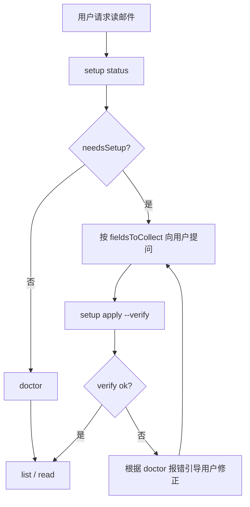

# Agent 引导式首次配置流程

本文是 **OpenClaw / Hermes / Codex / Cursor** 等 Agent 加载 `aliyun-enterprise-mail` 技能后的标准操作协议。

目标：用户 **clone 仓库 → 加载技能 → 对话中提供信息 → Agent 自动写入凭据 → 读信**，无需手动编辑文件。

## 红线（Agent 必须遵守）

1. **任何读信请求前**，先 `doctor` 或 `setup status`；若未配置则进入引导，不要直接报错结束。
2. **禁止**把用户提供的密码写入代码、注释、commit、日志、对话复述（可回复「已保存，邮箱 t***@domain.com」）。
3. **禁止**把 `local/credentials.env`、`.aliyun-mail.env` 提交到 Git。
4. 用户说「读邮件 / 查收件箱 / 看未读」时，即触发本 skill，**即使未提「配置」**。

## 标准流程



## Step 0：检测状态

```bash
python aliyun-enterprise-mail/scripts/read_mail.py setup status
```

关注 JSON 字段：

| 字段 | 含义 |
|------|------|
| `needsSetup` | `true` 时必须引导配置 |
| `fieldsToCollect` | 需向用户收集的字段清单（含 `agentPrompt`） |
| `recommendedWritePath` | 推荐写入路径（clone 场景多为 `.../aliyun-enterprise-mail/local/credentials.env`） |
| `existingCredentialFiles` | 已存在的凭据文件（脱敏） |

## Step 1：对话式收集（Agent 话术模板）

当 `needsSetup: true` 时，Agent 一次性说明并逐项收集：

> 要使用阿里企业邮箱读信，需要先完成一次性配置（凭据仅保存在本机，不会提交 Git）。
>
> 请提供以下信息：
> 1. **完整邮箱地址**（例如 name@company.com）
> 2. **客户端授权密码**（在网页邮箱「设置 → 账户与安全」生成；若管理员未开三方客户端需先开通）
> 3. **IMAP 主机**（可选，默认 `imap.qiye.aliyun.com`；香港节点用 `imaphk.qiye.aliyun.com`）

**收集规则**：

- 必填：`ALIYUN_MAIL_USER`、`ALIYUN_MAIL_PASSWORD`
- 可选：IMAP 主机/端口；用户跳过则用默认值
- 用户不确定主机时，用默认大陆节点即可
- 若用户只给了邮箱还没给密码，**继续追问**，不要半成品写入

## Step 2：写入凭据

用户给齐信息后，Agent 执行（**不要在命令行历史之外的地方重复密码**）：

```bash
python aliyun-enterprise-mail/scripts/read_mail.py setup apply \
  --user "user@company.com" \
  --password "CLIENT_AUTH_PASSWORD" \
  --target auto \
  --verify
```

`--target auto` 行为：

| 场景 | 写入位置 |
|------|----------|
| clone 的 skill 目录完整 | `<skill>/local/credentials.env` |
| 当前目录是 git 仓库 | `./.aliyun-mail.env` |
| 其它 | `~/.config/aliyun-enterprise-mail/credentials.env` |

也可显式指定：

```bash
# 始终写入 skill 内（clone 开箱即用推荐）
--target skill

# 写入当前项目根
--target repo

# 用户级全局
--target user
```

`--verify` 会在写入后自动跑 `doctor`，Agent 应检查 `verify.status === "ok"`。

## Step 3：验证并反馈

成功时告知用户：

> 邮箱已配置完成（`t***@company.com`），IMAP 连接正常。接下来要查收件箱、未读还是某封邮件？

失败时根据 `verify.checks` 引导：

| 错误 | Agent 引导 |
|------|------------|
| LOGIN failed | 确认客户端授权密码、管理员是否允许三方客户端 |
| connection refused | 检查 IMAP 主机、公司网络 |
| config_error | 重新收集缺失字段 |

## Step 4：读信

配置完成后，正常读信（会自动加载 `local/credentials.env`）：

```bash
python aliyun-enterprise-mail/scripts/read_mail.py list --folder INBOX --limit 10
python aliyun-enterprise-mail/scripts/read_mail.py read --uid <UID>
```

## Git 仓库与 clone 开箱即用

**提交到 Git 的**（所有人共享）：

- `SKILL.md`、`scripts/`、`credentials.env.example`
- `local/credentials.env.example`
- `local/.gitkeep`
- `.gitignore`（忽略真实凭据）

**绝不提交的**：

- `local/credentials.env`
- `.aliyun-mail.env`
- 任何含真实密码的文件

他人 clone 后：

1. Agent 加载 skill
2. 用户说「帮我读邮件」
3. Agent 跑 `setup status` → 发现 `needsSetup: true`
4. 对话收集 → `setup apply --verify`
5. 开始读信

**每人各自配置一次凭据**，skill 代码共用。

## 重新配置 / 换账号

```bash
python aliyun-enterprise-mail/scripts/read_mail.py setup apply \
  --user "new@company.com" \
  --password "NEW_PASSWORD" \
  --target skill \
  --verify
```

会覆盖原 `local/credentials.env`（先确认用户意图）。

## 与 OpenClaw / Hermes 的集成建议

完整复制块见 **`references/openclaw-hermes-registration.md`**。

在 Agent 的 skill 加载规则或 system prompt 中加入：

```
加载 aliyun-enterprise-mail 后：
- 读邮件前先 setup status
- needsSetup 则按 references/onboarding-flow.md 引导用户
- 禁止提交凭据文件到 Git
- 禁止在回复中复述密码
```

若平台支持 skill 目录变量，CLI 路径写为：

```bash
python ${SKILL_ROOT}/scripts/read_mail.py setup status
```

## 快速命令索引

| 命令 | 用途 |
|------|------|
| `setup status` | Agent 判断是否要引导配置 |
| `setup apply --verify` | 对话收集后写入并验证 |
| `doctor` | 检查连通性 |
| `list` / `read` | 读信 |
