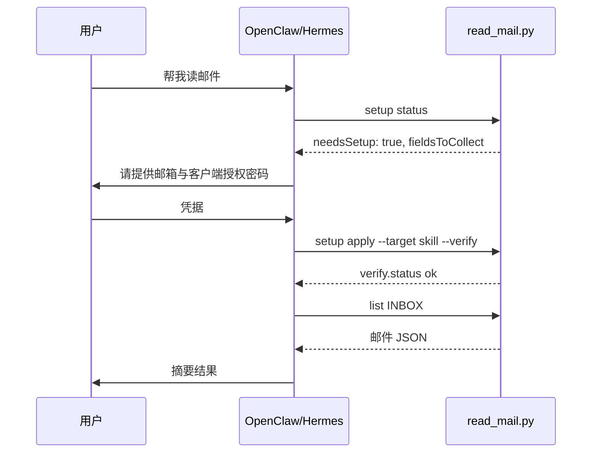

# OpenClaw / Hermes 注册配置（复制即用）

本文提供 **OpenClaw** 与 **Hermes Agent** 加载 `aliyun-enterprise-mail` 的可粘贴配置。  
Skill 在 Git 仓库中共享；**凭据每人本地配置**（Agent 对话 + `setup apply`）。

相关文档：

- 对话引导流程：`onboarding-flow.md`
- OpenClaw 片段源文件：`../agents/openclaw.yaml`
- Hermes 片段源文件：`../agents/hermes.yaml`

---

## 0. 克隆仓库（团队共用 skill 代码）

```bash
git clone https://github.com/zhou256bug/AI-Skills.git ~/Projects/AI-Skills
```

Skill 路径：`~/Projects/AI-Skills/aliyun-enterprise-mail/`

---

## 1. OpenClaw

官方文档：[Skills](https://docs.openclaw.ai/tools/skills) · [Skills config](https://docs.openclaw.ai/tools/skills-config)

### 1.1 注册 skill（monorepo 推荐）

编辑 `~/.openclaw/openclaw.json`：

```json5
{
  skills: {
    load: {
      extraDirs: ["~/Projects/AI-Skills"],
      watch: true,
    },
    entries: {
      "aliyun-enterprise-mail": {
        enabled: true,
      },
    },
  },
  agents: {
    defaults: {
      skills: ["aliyun-enterprise-mail"],
    },
  },
}
```

说明：

- `extraDirs` 扫描目录下所有 `*/SKILL.md`，本 skill 名为 `aliyun-enterprise-mail`
- **不要**在 `entries.*.env` 里写邮箱密码；由 Agent 跑 `setup apply` 写入 `local/credentials.env`
- 配置变更后**新开 session** 生效（或等 skill watcher 刷新）

### 1.2 仅安装单个 skill 目录（可选）

```bash
openclaw skills install ~/Projects/AI-Skills/aliyun-enterprise-mail --as aliyun-enterprise-mail
# 或安装到全局：
openclaw skills install ~/Projects/AI-Skills/aliyun-enterprise-mail --global
```

### 1.3 Agent 行为指令（粘贴到 agent 自定义 instruction）

```
加载 aliyun-enterprise-mail 后：
1. 用户说读邮件/收件箱/未读 → 先运行 setup status
2. needsSetup=true → 按 aliyun-enterprise-mail/references/onboarding-flow.md 向用户收集：
   - 完整邮箱
   - 客户端授权密码
   - IMAP 主机（可选，默认 imap.qiye.aliyun.com）
3. 运行 setup apply --target skill --verify
4. 禁止提交 local/credentials.env；禁止在回复中复述密码
5. 验证通过后 list / read
```

### 1.4 CLI 路径模板

将 `{skill_dir}` 替换为实际路径：

```bash
SKILL_DIR=~/Projects/AI-Skills/aliyun-enterprise-mail

python "$SKILL_DIR/scripts/read_mail.py" setup status
python "$SKILL_DIR/scripts/read_mail.py" setup apply \
  --user "you@company.com" \
  --password "CLIENT_AUTH_PASSWORD" \
  --target skill \
  --verify
python "$SKILL_DIR/scripts/read_mail.py" list --folder INBOX --limit 10
```

OpenClaw 可在 skill body 中用 `{baseDir}` 引用 skill 目录。

---

## 2. Hermes Agent

官方文档：[Skills System](https://hermes-agent.nousresearch.com/docs/user-guide/features/skills)

### 2.1 注册外部 skill 目录（monorepo 推荐）

编辑 `~/.hermes/config.yaml`：

```yaml
skills:
  external_dirs:
    - ~/Projects/AI-Skills
```

Hermes 会扫描该目录下所有 `*/SKILL.md`，与本地 `~/.hermes/skills/` 合并；**同名时本地优先**。

### 2.2 或拷贝 / 软链到本地 skills

```bash
ln -sf ~/Projects/AI-Skills/aliyun-enterprise-mail \
  ~/.hermes/skills/aliyun-enterprise-mail
```

### 2.3 Hermes Bundle（可选 slash 命令）

复制 bundle 到 Hermes bundles 目录：

```bash
mkdir -p ~/.hermes/skill-bundles
cp ~/Projects/AI-Skills/aliyun-enterprise-mail/bundles/mail-assistant.hermes.yaml \
   ~/.hermes/skill-bundles/mail-assistant.yaml
```

使用：

```text
/mail-assistant 帮我看最近 10 封收件箱
```

Bundle 内容见 `bundles/mail-assistant.hermes.yaml`。

### 2.4 对话式使用

```bash
hermes chat --toolsets terminal,skills -q "帮我看收件箱有什么邮件"
```

Agent 应自动加载 `aliyun-enterprise-mail`，执行 `setup status`，未配置则进入引导。

### 2.5 Agent 行为指令

与 OpenClaw 相同（见 1.3），Hermes 通过 `skill_view("aliyun-enterprise-mail")` 加载 SKILL.md。

### 2.6 CLI 路径模板

```bash
SKILL_DIR=~/Projects/AI-Skills/aliyun-enterprise-mail

python "$SKILL_DIR/scripts/read_mail.py" setup status
python "$SKILL_DIR/scripts/read_mail.py" list --folder INBOX --limit 10
```

---

## 3. 首次使用完整流程（两平台通用）



---

## 4. Git 边界（团队 clone 必知）

| 提交到 Git | 不提交 |
|------------|--------|
| `SKILL.md`、`scripts/`、`agents/*.yaml` | `local/credentials.env` |
| `bundles/`、`credentials.env.example` | `.aliyun-mail.env` |
| `references/*.md` | 任何含真实密码的文件 |

他人 clone 后：**代码即开即用，凭据各自配一次**。

---

## 5. 排错

| 现象 | OpenClaw | Hermes |
|------|----------|--------|
| skill 未出现 | 检查 `extraDirs` 路径、新开 session | 检查 `external_dirs`、重启 chat |
| 找不到 python | 确保 `python3` 在 PATH；sandbox 内需安装 | `--toolsets terminal` |
| 已配置仍 needsSetup | 确认 `local/credentials.env` 存在且 chmod 600 | 同上 |
| Cloud/远程 Agent | 本机路径不可用；改用 env 注入或 Secrets | 同左 |

---

## 6. 文件索引

| 文件 | 用途 |
|------|------|
| `agents/openclaw.yaml` | OpenClaw 配置片段（机器可读） |
| `agents/hermes.yaml` | Hermes 配置片段 |
| `agents/openai.yaml` | Cursor 类 Agent 入口 |
| `bundles/mail-assistant.hermes.yaml` | Hermes `/mail-assistant` bundle |
| `references/onboarding-flow.md` | Agent 对话引导主协议 |
