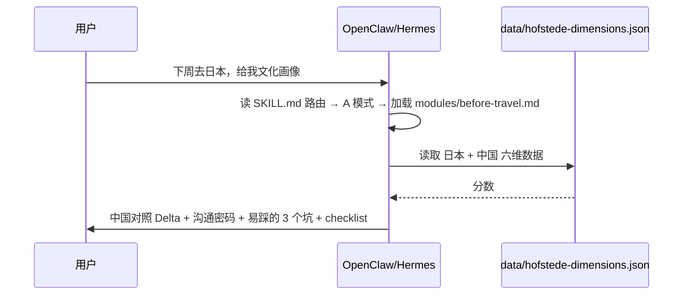

# OpenClaw / Hermes 注册配置（复制即用）

本文提供 **OpenClaw** 与 **Hermes Agent** 加载 `cross-cultural-consultant` 的可粘贴配置。

本 skill **知识与数据自包含、无任何凭据**：clone 仓库 → 注册目录 → 直接用。
（仅"手机 PDF"为可选能力，需额外本机依赖，见文末。）

相关源文件：

- OpenClaw 片段：`../agents/openclaw.yaml`
- Hermes 片段：`../agents/hermes.yaml`
- Cursor 类 Agent 入口：`../agents/openai.yaml`
- Hermes bundle：`../bundles/cross-cultural-consultant.hermes.yaml`

---

## 0. 克隆仓库（团队共用 skill 代码）

```bash
git clone https://github.com/zhou256bug/AI-Agent-Skills.git ~/Projects/AI-Agent-Skills
```

Skill 路径：`~/Projects/AI-Agent-Skills/cross-cultural-consultant/`

---

## 1. OpenClaw

官方文档：[Skills](https://docs.openclaw.ai/tools/skills) · [Skills config](https://docs.openclaw.ai/tools/skills-config)

### 1.1 注册 skill（monorepo 推荐）

编辑 `~/.openclaw/openclaw.json`：

```json5
{
  skills: {
    load: {
      extraDirs: ["~/Projects/AI-Agent-Skills"],
      watch: true,
    },
    entries: {
      "cross-cultural-consultant": {
        enabled: true,
      },
    },
  },
  agents: {
    defaults: {
      skills: ["cross-cultural-consultant"],
    },
  },
}
```

说明：

- `extraDirs` 扫描目录下所有 `*/SKILL.md`，本 skill 名为 `cross-cultural-consultant`
- 无需任何 env / 密码（纯知识 skill）
- 配置变更后**新开 session** 生效（或等 skill watcher 刷新）

### 1.2 仅安装单个 skill 目录（可选）

```bash
openclaw skills install ~/Projects/AI-Agent-Skills/cross-cultural-consultant --as cross-cultural-consultant
```

### 1.3 Agent 行为指令（粘贴到 agent 自定义 instruction）

```
加载 cross-cultural-consultant 后：
1. 按 SKILL.md「三、场景路由表」的触发词只加载对应 module（渐进式加载）
2. 任何国别分析必须读 data/hofstede-dimensions.json，并给出中国基线 Delta
3. null 维度标 N/A，不编造；至少 2 类 [D]/[F]/[C] 证据标签
4. 输出不含 /Users/... 等本地绝对路径
```

---

## 2. Hermes Agent

官方文档：[Skills System](https://hermes-agent.nousresearch.com/docs/user-guide/features/skills)

### 2.1 注册外部 skill 目录（monorepo 推荐）

编辑 `~/.hermes/config.yaml`：

```yaml
skills:
  external_dirs:
    - ~/Projects/AI-Agent-Skills
```

Hermes 会扫描该目录下所有 `*/SKILL.md`，与本地 `~/.hermes/skills/` 合并；**同名时本地优先**。

### 2.2 或拷贝 / 软链到本地 skills

```bash
ln -sf ~/Projects/AI-Agent-Skills/cross-cultural-consultant \
  ~/.hermes/skills/cross-cultural-consultant
```

### 2.3 Hermes Bundle（可选 slash 命令）

```bash
mkdir -p ~/.hermes/skill-bundles
cp ~/Projects/AI-Agent-Skills/cross-cultural-consultant/bundles/cross-cultural-consultant.hermes.yaml \
   ~/.hermes/skill-bundles/cross-cultural-consultant.yaml
```

使用：

```text
/cross-cultural-consultant 下周去日本拜访客户，给我完整文化画像
```

### 2.4 对话式使用

```bash
hermes chat --toolsets terminal,skills -q "下周去日本拜访客户，给我完整文化画像"
```

---

## 3. 首次使用完整流程（两平台通用）



---

## 4. Git 边界（团队 clone 必知）

| 提交到 Git | 不提交 |
|------------|--------|
| `SKILL.md`、`modules/`、`frameworks/`、`data/` | `output/`（PDF 等本地产物） |
| `agents/*.yaml`、`bundles/`、`references/*.md` | `__pycache__/`、`*.pyc` |
| `evaluation/run_evals.py`、`evals.json` | `.DS_Store` |

本 skill **无凭据文件**，clone 后代码与数据即开即用。

---

## 5. 自检与排错

```bash
SKILL_DIR=~/Projects/AI-Agent-Skills/cross-cultural-consultant
python3 "$SKILL_DIR/scripts/validate-data.py"     # 校验 119 国数据完整
python3 "$SKILL_DIR/evaluation/run_evals.py"      # 校验路由用例与 module 引用
```

| 现象 | OpenClaw | Hermes |
|------|----------|--------|
| skill 未出现 | 检查 `extraDirs` 路径、新开 session | 检查 `external_dirs`、重启 chat |
| 找不到 python3 | 确保 `python3` 在 PATH | `--toolsets terminal` |
| 手机 PDF 失败 | 安装 weasyprint / ghostscript / PyMuPDF + Noto Sans SC 字体 | 同左 |

---

## 6. 可选依赖（仅手机 PDF 需要）

`scripts/render_mobile_pdf.py` 依赖：

- 命令：`weasyprint`、`ghostscript`（`gs`）
- Python 包：`PyMuPDF`（脚本内 `import fitz`，用于裁剪）
- 字体：Noto Sans SC（脚本用 `Path.home()` 定位，不依赖特定用户路径）

未安装时不影响 A/B/D/E 等文本模式；直接交付 Markdown 即可。

---

## 7. 文件索引

| 文件 | 用途 |
|------|------|
| `agents/openclaw.yaml` | OpenClaw 配置片段（机器可读） |
| `agents/hermes.yaml` | Hermes 配置片段 |
| `agents/openai.yaml` | Cursor 类 Agent 入口 |
| `bundles/cross-cultural-consultant.hermes.yaml` | Hermes slash 命令 bundle |
| `scripts/validate-data.py` | 数据完整性自检 |
| `evaluation/run_evals.py` | 路由用例 / module 引用自检 |
