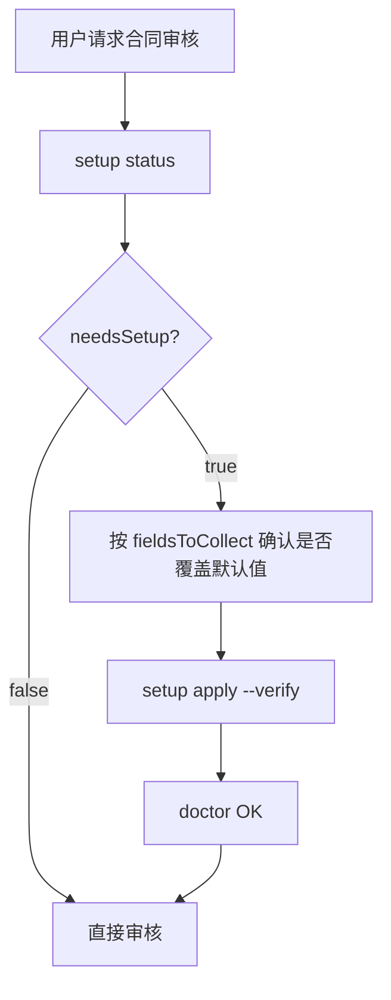

# 华智融法务技能 — Agent 引导配置流程

本技能**无密码凭据**，`setup` 用于个性化业务配置（决策者、公司名、归档路径、签约主体）。默认值即可开箱使用。

## 何时触发

1. 用户**首次**使用 `/legal-affairs` 或说「配置法务技能」
2. 用户要求修改决策者称呼、归档目录、签约主体
3. Agent 输出中需引用正确主体名称时

## 流程



## CLI 命令

```bash
# 1. 查看状态
python3 huazhirong-legal-affairs/scripts/legal_affairs_cli.py setup status

# 2. 写入配置（示例）
python3 huazhirong-legal-affairs/scripts/legal_affairs_cli.py setup apply \
  --decision-maker 老板 \
  --company 华智融 \
  --archive-dir ./output \
  --entity-cn "深圳华智融科技股份有限公司" \
  --entity-hk "NEW POS GLOBAL HOLDING (HONG KONG) LIMITED" \
  --target skill \
  --verify

# 3. 健康检查
python3 huazhirong-legal-affairs/scripts/legal_affairs_cli.py doctor
```

## Agent 对话引导话术

当 `needsSetup: true` 时，可向用户确认：

> 法务技能可以用默认配置直接开始（决策者：老板，公司：华智融）。
> 是否需要自定义？
> 1. 决策者称呼（审核意见中的决策人）
> 2. 归档目录（默认 `<skill>/output`）
> 3. 境内/境外常用签约主体名称

用户确认后执行 `setup apply --verify`。

## 配置落盘

| target | 路径 |
|--------|------|
| skill（推荐） | `<skill>/local/credentials.env` |
| repo | `./.legal-affairs.env` |

文件已 gitignore，勿提交。

## 与合同审核的关系

- 配置写入后，`legal_affairs_config.py` 自动读取
- 审核意见中的「升级老板」使用 `LEGAL_AFFAIRS_DECISION_MAKER`
- 涉及签约主体时引用 `ENTITY_CN` / `ENTITY_HK`
